# Artificial Intelligence

## Project Grade

| Project Number | Grade   | Link to Directory      |
| -------------- | ------- | ---------------------- |
| Project        | 17.8/20 | [Project](./project)   |

## Contributors

| Name                             | Email                         |
| -------------------------------- | ----------------------------- |
| Eduardo Machado Teixeira de Sousa | up202103342@up.pt             |
| João Brandão Alves               | up202108670@up.pt             |

## Practical Classes

All exercises from the practical classes are fully completed and can be found within their respective directories.

## Project

### Improvements for a Higher Grade
To achieve a better grade, the following improvements were suggested:
- **Panorama**: Adjust to ensure it gives the impression of an infinite horizon.
- **Bee Textures**: Improve the application of textures on the bees.
- **Bee Controls**: Make the bee controls less sensitive.

Note: The inclusion of clouds and fog was an extra feature and was not mandatory.

### Project Features and Screenshots

#### Panorama
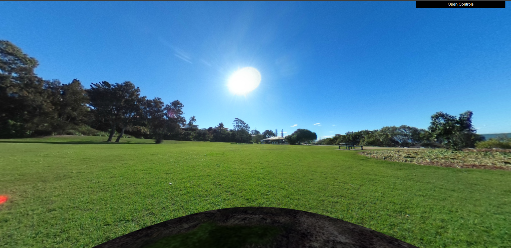
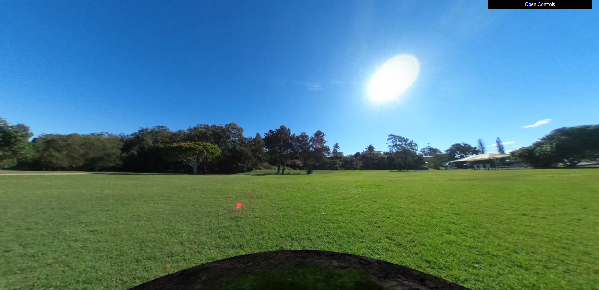

#### Flowers
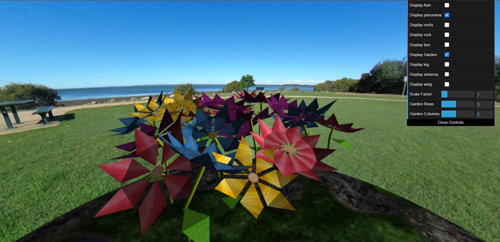
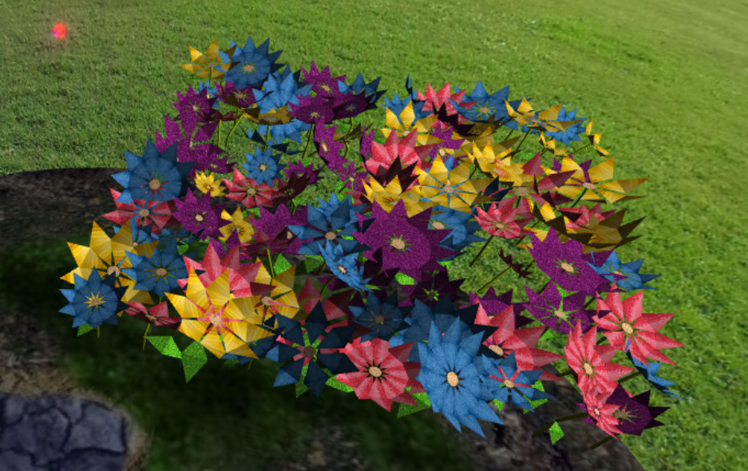
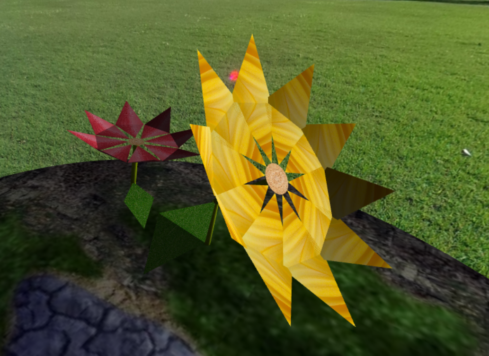

#### Rocks
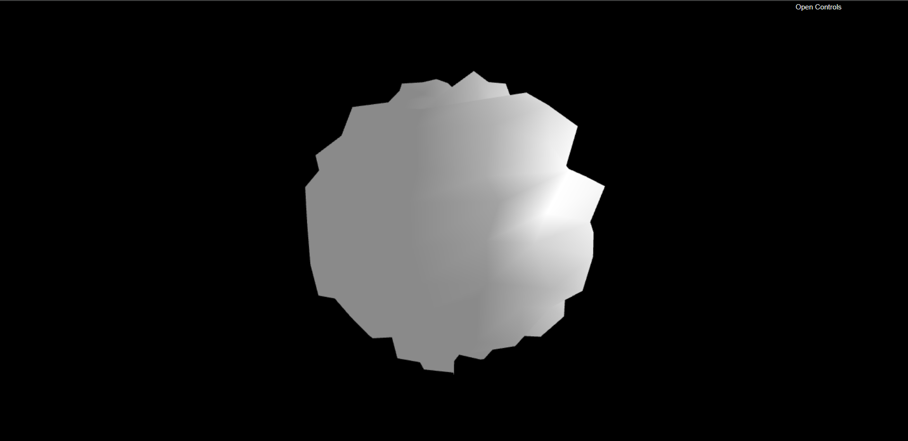
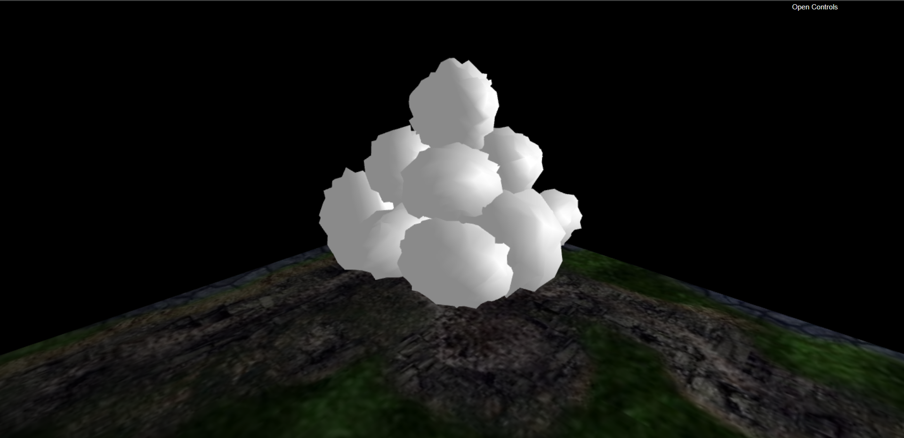
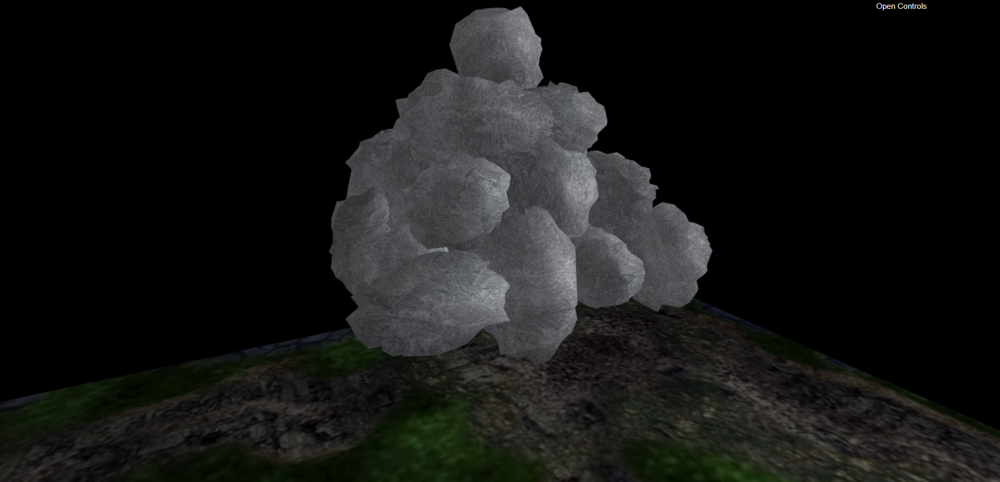

#### Bee
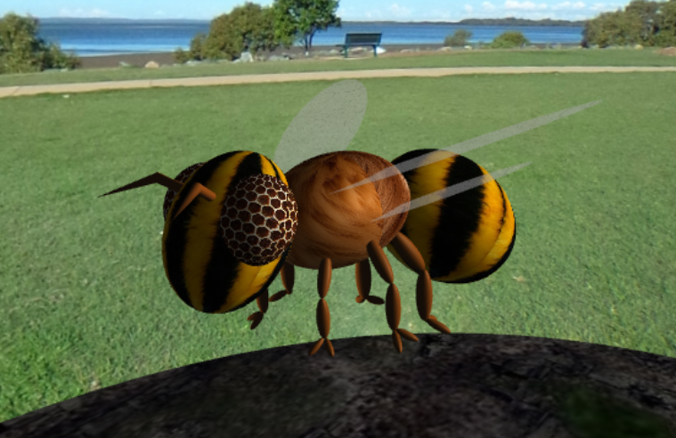
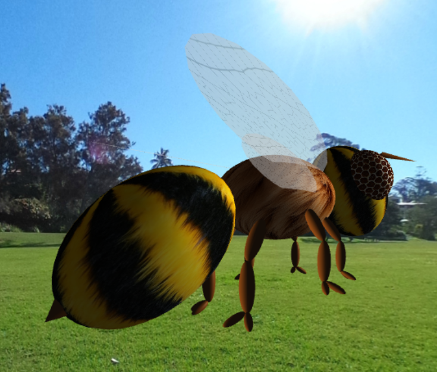
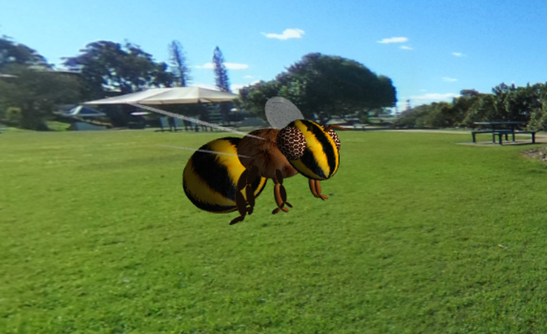

#### Beehive and Pollen
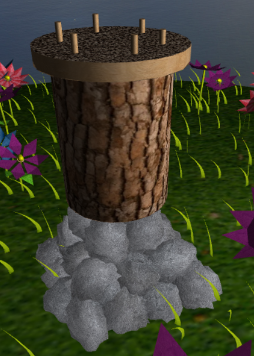
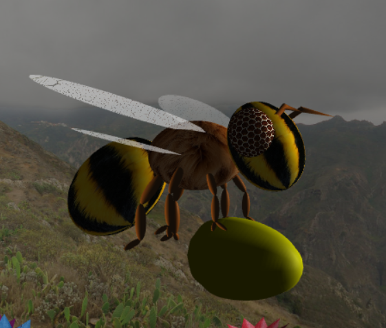
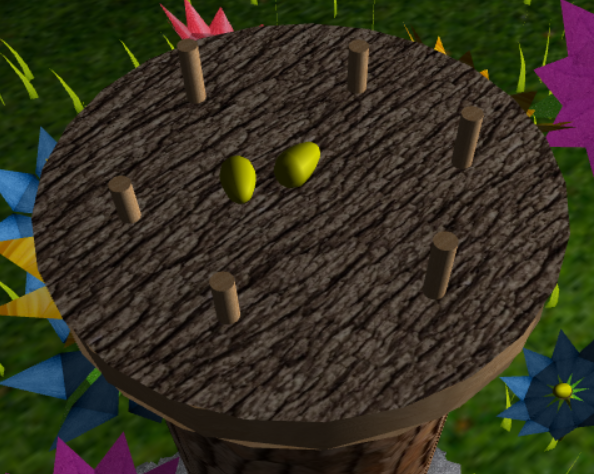

#### Grass
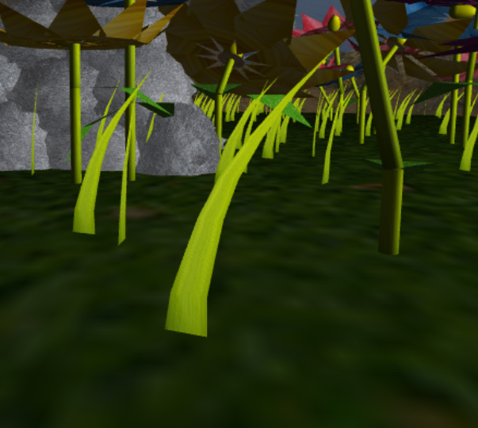
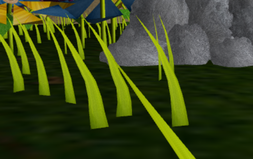

#### Clouds/Fog
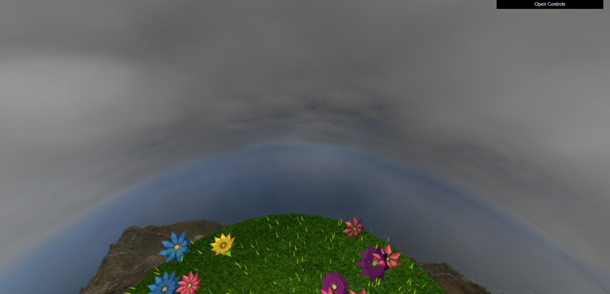
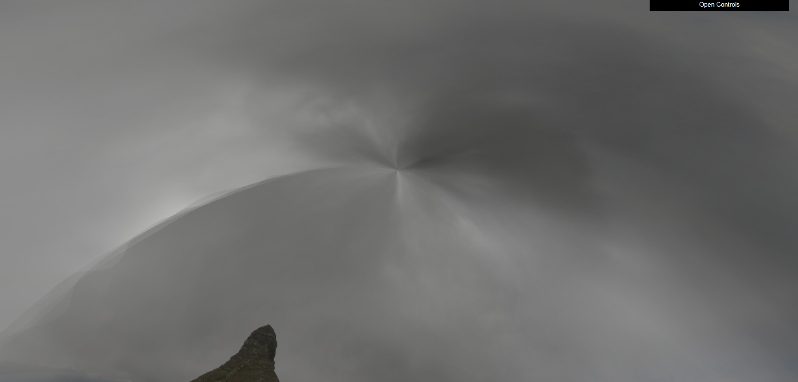
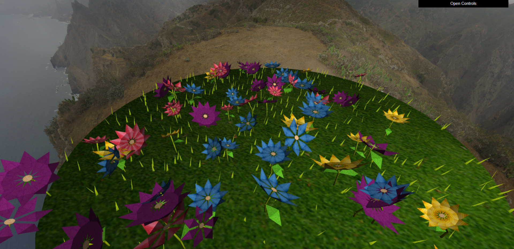

## Important Notice

**Warning**: Remember that copying the project to make yours, might get you caught by a plagiarism test.
