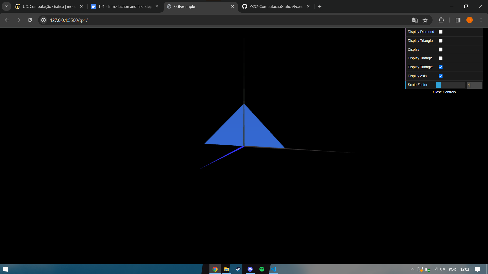

# CG 2023/2024

## Group T04G05

## TP 1 Notes

- In exercise 1, we were able to develop MyTriangle.js, which has one base triangle, and MyParallelogram.js, which has four triangles—two in front and two behind—using the base code of MyDiamond.js. To regulate which figures are visible at all, we included checkboxes in both figures;
- We found exercise 2 easy to do sicne it consists in replicating what we had already done in exercise 1, just changing the coordinates of the vertices.

