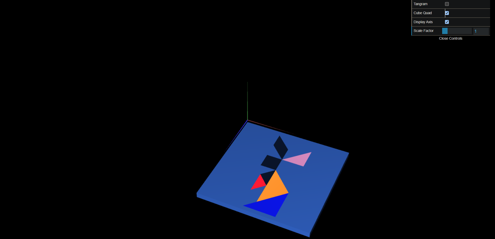

# CG 2023/2024

## Group T04G05

## TP 2 Notes

- In exercise 1, a single MyTangram.js can be produced using visual transformations from the figures made in class TP1. Organization of the components particularly the diamond was the most difficult as not all values to be used in the transformations are integers. Additionally, an option to adjust the tangram's visibility was included.

- In the second task, we constructed a unit cube with the reference frame's origin in its upper left vertex. In order to accomplish this, we had to specify the locations of the 12 triangles and 8 vertices that made up the mesh, making sure that each of the cube's outside faces was visible. After joining the two earlier figures, we were able to rotate them about the X axis and bring them parallel to the XZ plane.

- In exercise 3, we constructed an additional unit cube, but this time we used a square plane (consisting of two triangles) as the base. Because this technique is modular, it was easier to put into practice.

