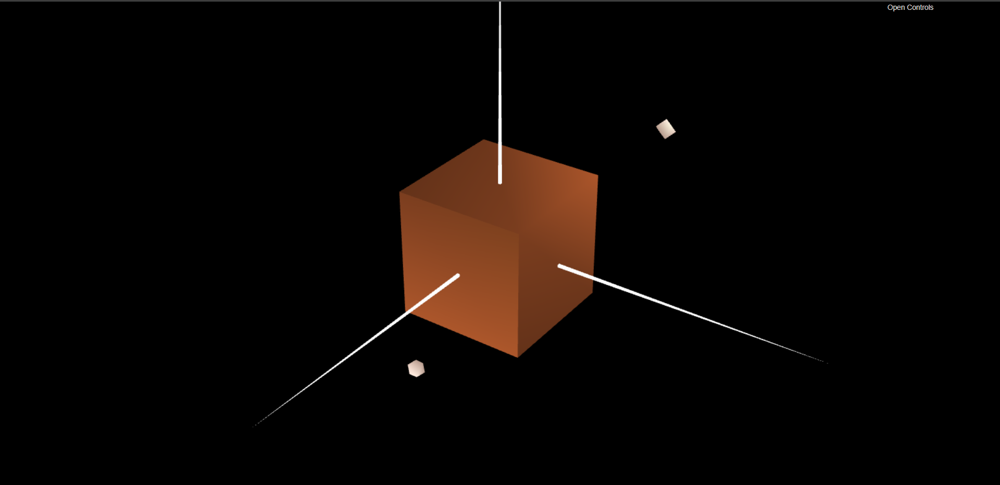
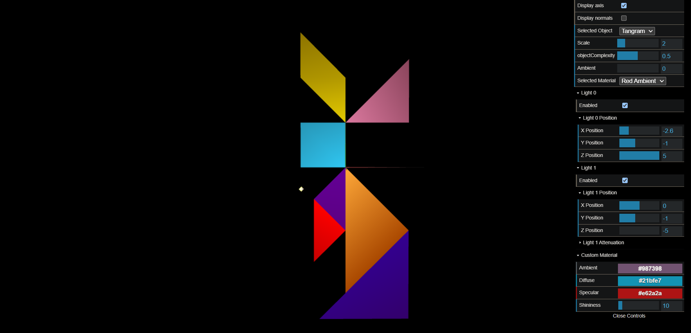
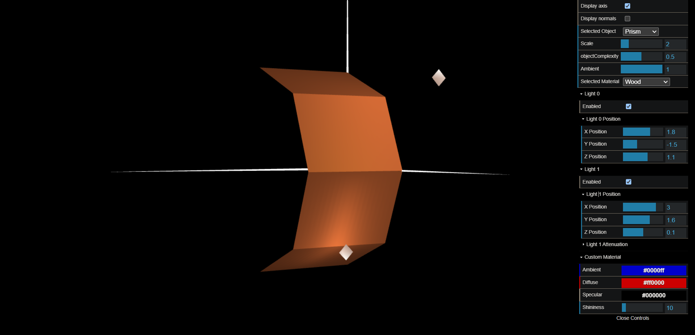
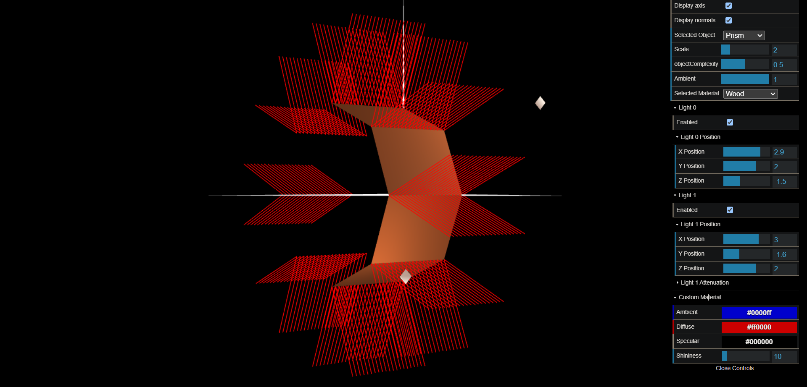
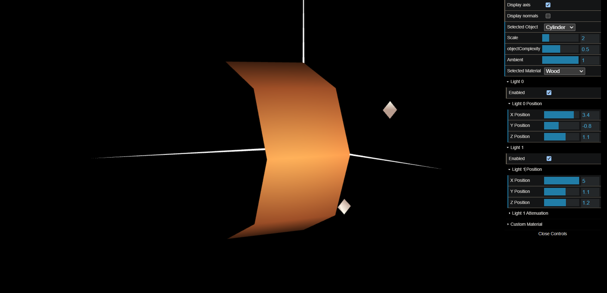

# CG 2023/2024

## Group T04G05

## TP 3 Notes

In exercise 1, we constructed all the normals required for the predicted luminosity to make sense according to the angle of incidence of the light and the viewing angle, based on the figures created in classes TP1 and TP2. We produced a material with a low specular component and a color like wood.

We also applied different materials with a high specular component to the tangram figures in exercise 1.

In exercise 2, we constructed a prism with a configurable number of sides and complexity. Developing an effective algorithm to generate vertices, define the triangles, and generate normalized normals at each vertex proved to be a very difficult task. Due to the similarity of the normals for the same face, the calculated illumination was comparable to that calculated using 'Constant Shading'.

The normals were positioned perpendicular to each edge in exercise 3. As a result, there were fewer vertices and normals to compute. As anticipated, the illumination changes around the edges were less noticeable, smoothed out, and gave the surface of the prior prism a curved aspect.

