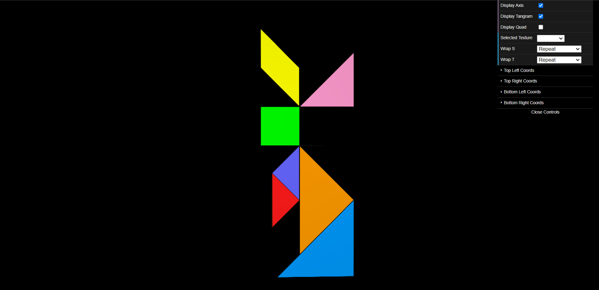
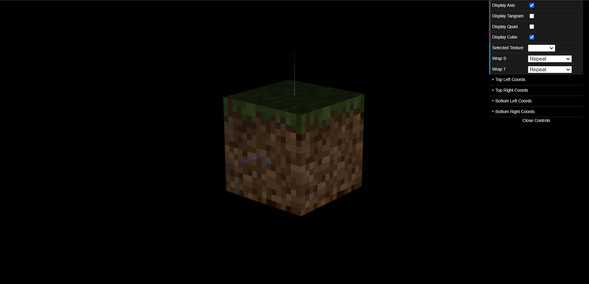

# CG 2023/2024

## Group T04G05

## TP 4 Notes

In the first exercise, we mapped every vertex of every polygon in the figure with the tangram texture given. Determining the texture coordinates for every polygon and knowing which way the axes were applied to it presented the largest obstacle. 

Figure with tangram textures applied

We got this result from applying the dirt minecraft block textures to our cube.

